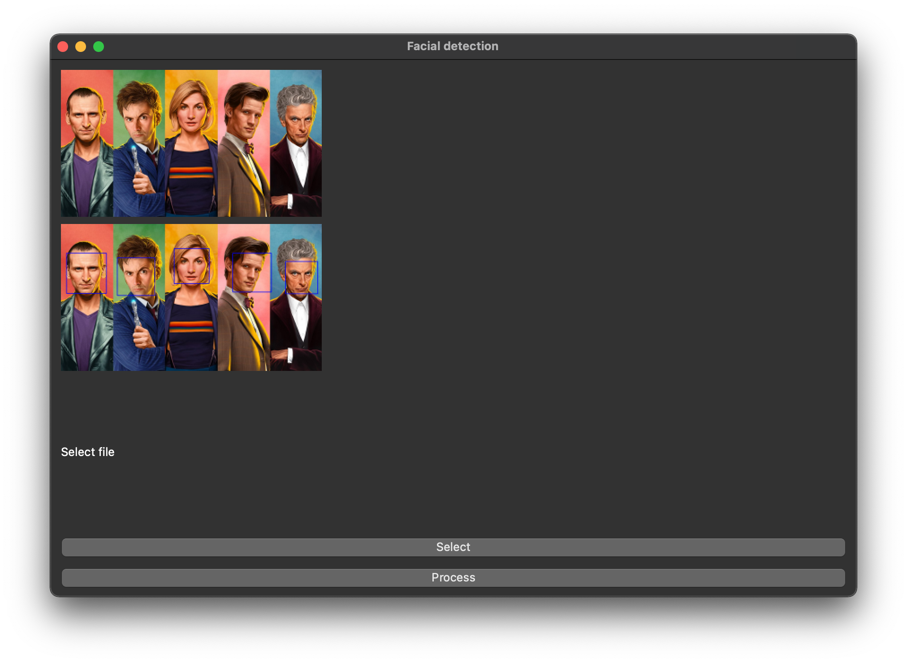

facial detection with opencv2
------------

Install
------

Install requirements with pip

```
pip3 install -r requirements.txt
```

Run web server:
--------------
```
python3 server.py
```

Open `http://localhost:8999/ui/index.html` in your browser

Run PyQt5 gui:
-------------

```
python3 gui.py
```




